# Tommy — Spec-Driven Development Workflow

**English** | [Português](#fluxo-tommy-pt-br)

This diagram maps the possible flows of the Spec-Driven Development (SDD) technique as implemented by Tommy: **Specify → Prompt → Codegen**, plus the Bootstrap step that precedes it and the two independent Versioning actions (Commit, Open PR/MR) that sit outside the three-phase backbone. It includes the conditionals that branch each flow and the observations that explain *why* — see the note boxes (yellow) inline.

The diagram below is drawn as a [Mermaid](https://mermaid.js.org) flowchart so it renders directly on GitHub and in most Markdown viewers.

```mermaid
flowchart TD
    classDef note fill:#FFF9C4,stroke:#C9B458,stroke-width:1px,color:#333,font-style:italic;
    classDef phase fill:#F0F4FF,stroke:#4A6FA5,color:#1a1a2e,font-weight:bold;
    classDef terminal fill:#E8F5E9,stroke:#2E7D32,color:#1a1a2e;

    Start(["User opens a project"]) --> Q1{".tommy/ scaffolding complete?<br/>(scripts, templates, project-context, codebase)"}
    Q1 -->|No| Boot["Tommy Start<br/>scaffold .tommy/, research codebase & product context,<br/>fill TOMMY.md, create AGENTS.md,<br/>propose opt-in capabilities (MCP wiring & servers,<br/>Sonar properties, find-skills) — always user-confirmed"]:::phase
    Q1 -->|Yes| Specify
    Boot --> Specify

    N1["Every Tommy agent self-checks for this scaffolding<br/>and self-triggers Tommy Start if it is missing —<br/>the workflow never hard-fails just because<br/>/tommy-start was skipped."]:::note
    Boot -.-> N1

    Specify["Specify<br/>describe the feature in natural language"]:::phase --> Branch1["Create feature branch<br/>'NNN-short-name' and spec.md"]
    Branch1 --> Elicit["Business Analyst skill elicits requirements<br/>(interactive rounds, 3-5 questions at a time)"]
    Elicit --> WriteSpec["Write / refine spec.md<br/>(goals, user stories, acceptance criteria, non-goals)"]
    WriteSpec --> PMReview["Product Review (PM lens, independent)<br/>value, scope, completeness, audience —<br/>only this reviewer marks the requirements checklist"]
    PMReview --> Q2{"Reviewer approves<br/>the spec?"}
    Q2 -->|"No (fix and re-review, up to 3x)"| WriteSpec
    Q2 -->|Yes| PromptPhase

    N2["If still failing after 3 iterations, escalate the<br/>open questions to the user instead of looping forever.<br/>In Claude Code the reviewer is the fresh-context<br/>tommy-product-review agent; in Cursor/Copilot it is a<br/>self-enforced role switch at the end of the phase."]:::note
    Q2 -.-> N2

    PromptPhase["Prompt<br/>reference the approved spec"]:::phase --> Architect["Architect designs implementation architecture,<br/>bounded contexts, data model"]
    Architect --> WritePlan["Write detailed implementation plan<br/>+ its own checklist"]
    WritePlan --> PlanReady(["Plan file ready in<br/>.tommy/specs/.../plans/"])

    PlanReady --> Codegen["Codegen<br/>pick one plan file to implement"]:::phase
    Codegen --> Q3{"Plan's own checklist<br/>fully checked?"}
    Q3 -->|No| StopReport(["Stop and report the plan<br/>as not yet validated"]):::terminal
    Q3 -->|Yes| Implement["Implement / fix code and tests"]
    Implement --> Q4{"Quality gate passes?<br/>(lint, tests incl. e2e, complexity, patterns,<br/>Sonar, frontend audit, security scan, checklist)"}
    Q4 -->|No| Implement
    Q4 -->|Yes| Accept["Acceptance review (spec→code traceability)<br/>map every acceptance criterion to code + test evidence,<br/>write checklists/acceptance.md"]
    Accept --> Q10{"All criteria MET<br/>(or justified)?"}
    Q10 -->|"No (fix the gaps, up to 2 cycles)"| Implement
    Q10 -->|Yes| CodeReady(["Code ready — report to user"]):::terminal

    N7["The quality gate persists its evidence in<br/>.tommy/.quality-gate-status; in Claude Code a Stop hook<br/>(tommy-quality-sentinel) refuses to end a session with<br/>changed code files and no fresh quality-gate evidence."]:::note
    Q4 -.-> N7

    N3["Versioning is not a fourth phase — two independent<br/>actions available at any point, each only ever triggered<br/>by an EXPLICIT user request. No Tommy agent commits<br/>or opens a PR/MR on its own initiative."]:::note
    CodeReady -.-> N3

    CodeReady --> Q5{"User explicitly<br/>asks to commit?"}
    CodeReady --> Q6{"User explicitly asks<br/>to open a PR/MR?"}

    Q5 -->|Yes| Commit["Tommy Commit — review diff,<br/>propose Conventional Commit message(s)"]
    Q5 -->|"Not yet"| EndA(["(nothing happens until asked)"])
    Commit --> Q7{"User confirms<br/>message & files?"}
    Q7 -->|Yes| DoCommit["git commit<br/>(one or more commits per branch/plan,<br/>e.g. one per finished checklist item)"]:::terminal
    Q7 -->|No| Revise["Revise the proposed message"] --> Commit

    Q6 -->|Yes| Q8{"Provider already known in<br/>.tommy/codebase/integrations.md?"}
    Q6 -->|"Not yet"| EndB(["(nothing happens until asked)"])
    Q8 -->|Yes| Switch{"Detected provider?"}
    Q8 -->|No| Q9{"Remote hostname matches a known pattern?<br/>(github.com / gitlab* / dev.azure.com / visualstudio.com)"}
    Q9 -->|Yes| Switch
    Q9 -->|No| AskProvider["Ask the user which<br/>provider/tool to use"] --> Switch

    N4["Self-hosted hostnames are not reliable evidence —<br/>never guess. The answer is recorded in integrations.md<br/>so this is not asked again next time."]:::note
    AskProvider -.-> N4

    Switch -->|GitHub| GH["gh pr create"]
    Switch -->|GitLab| GL["glab mr create"]
    Switch -->|"Azure DevOps"| AZ["az repos pr create"]
    Switch -->|"Unsupported host<br/>(e.g. GCP Cloud Source Repositories)"| NoPR["Push the branch only,<br/>report PR/MR not supported"]

    N5["GitLab calls this a Merge Request,<br/>not a Pull Request."]:::note
    GL -.-> N5

    GH --> Report(["Report the PR/MR URL to the user"]):::terminal
    GL --> Report
    AZ --> Report
    NoPR --> Report

    N6["Never adds a 'Co-authored-by:' trailer or any<br/>AI-attribution footer to a commit or PR/MR body.<br/>Commit author is always the local git identity<br/>(git config user.name / user.email)."]:::note
    DoCommit -.-> N6
    Report -.-> N6
```

## Observations not shown in the diagram

- **Claude Code** runs the full flow above with a mixed structure: `/tommy-specify` and `/tommy-prompt` are **commands** orchestrating in the main conversation (a subagent cannot invoke another subagent, and requirements elicitation needs a real dialog with the user), the Business Analyst is an interactive **skill**, and `tommy-architect`, `tommy-product-review`, `tommy-codegen`, and `tommy-git` are **agents** with `tools:` access restricted by role (`tommy-git` carries 4 skills: Conventional Commits + one adapter per provider).
- **Cursor** and **GitHub Copilot** run the same flow, condensed: Specify absorbs the Business Analyst elicitation and the PM review (self-enforced role switch), Prompt absorbs Architect, Codegen closes with the acceptance traceability matrix itself, and Commit/Open-PR are condensed into 2 files each. Neither tool can technically restrict which tools a phase may use, so phase separation (e.g. not writing code during Specify/Prompt) is **self-enforced discipline**, not a technical guarantee.
- The quality gate's automatable checks run through stack-aware scripts in `.tommy/scripts/quality/` (`quality-check.sh`, `complexity-check.sh`, `sonar-run.sh`) — tool-agnostic, no MCP server required. Conditional gates (Sonar, frontend audit) record **SKIP with a reason** when their prerequisites are absent; that is a valid, non-blocking outcome.
- Project MCP servers are canonical in `.tommy/mcp.json`, projected into each tool's native location (`.mcp.json` at the root — optional, per-project choice persisted in `.tommy/config.json` —, `.cursor/mcp.json`, `.vscode/mcp.json`); see `common/templates/mcp/mcp-catalog.md`.
- Every Tommy instruction treats project file content (`.tommy/resources/`, codebase, specs, plans) as **data, not instructions** — directives embedded in those files are never followed.
- Every step above that writes narrative content (spec, plan, commit body, PR/MR description) writes it in the project's configured language (`pt-BR` unless stated otherwise); code identifiers and Conventional Commit keywords stay in English.

---

# Fluxo Tommy (PT-BR)

[English](#tommy--spec-driven-development-workflow) | **Português**

Este diagrama mapeia os fluxos possíveis da técnica de Spec-Driven Development (SDD) como implementada pelo Tommy: **Specify → Prompt → Codegen**, mais a etapa de Bootstrap que a precede e as duas ações independentes de Versionamento (Commit, Abrir PR/MR) que ficam fora da espinha dorsal de três fases. Inclui as condicionais que ramificam cada fluxo e as observações que explicam o *porquê* — ver as caixas de nota (amarelas) no próprio diagrama.

O diagrama abaixo é um flowchart [Mermaid](https://mermaid.js.org), renderizado diretamente no GitHub e na maioria dos visualizadores de Markdown.

```mermaid
flowchart TD
    classDef note fill:#FFF9C4,stroke:#C9B458,stroke-width:1px,color:#333,font-style:italic;
    classDef phase fill:#F0F4FF,stroke:#4A6FA5,color:#1a1a2e,font-weight:bold;
    classDef terminal fill:#E8F5E9,stroke:#2E7D32,color:#1a1a2e;

    Start(["Usuário abre um projeto"]) --> Q1{"Scaffolding de .tommy/ completo?<br/>(scripts, templates, project-context, codebase)"}
    Q1 -->|Não| Boot["Tommy Start<br/>cria .tommy/, pesquisa codebase e contexto de produto,<br/>preenche TOMMY.md, cria AGENTS.md,<br/>propõe capacidades opt-in (wiring e servidores MCP,<br/>properties do Sonar, find-skills) — sempre com confirmação do usuário"]:::phase
    Q1 -->|Sim| Specify
    Boot --> Specify

    N1["Todo agente Tommy confere esse scaffolding<br/>e autodispara o Tommy Start quando falta —<br/>o fluxo nunca falha só porque<br/>o /tommy-start foi pulado."]:::note
    Boot -.-> N1

    Specify["Specify<br/>descreva a feature em linguagem natural"]:::phase --> Branch1["Cria a branch da feature<br/>'NNN-nome-curto' e o spec.md"]
    Branch1 --> Elicit["Skill de Business Analyst elicita requisitos<br/>(rodadas interativas, 3-5 perguntas por vez)"]
    Elicit --> WriteSpec["Escreve / refina o spec.md<br/>(objetivos, user stories, critérios de aceite, non-goals)"]
    WriteSpec --> PMReview["Product Review (lente de PM, independente)<br/>valor, escopo, completude, audiência —<br/>só este revisor marca o checklist de requisitos"]
    PMReview --> Q2{"Revisor aprova<br/>a spec?"}
    Q2 -->|"Não (corrige e re-revisa, até 3x)"| WriteSpec
    Q2 -->|Sim| PromptPhase

    N2["Se ainda falhar após 3 iterações, escale as<br/>questões abertas ao usuário em vez de iterar para sempre.<br/>No Claude Code o revisor é o agente tommy-product-review<br/>com contexto novo; no Cursor/Copilot é uma troca de papel<br/>autodisciplinada ao final da fase."]:::note
    Q2 -.-> N2

    PromptPhase["Prompt<br/>referencie a spec aprovada"]:::phase --> Architect["Architect desenha a arquitetura de implementação,<br/>bounded contexts, modelo de dados"]
    Architect --> WritePlan["Escreve o plano de implementação detalhado<br/>+ o checklist do próprio plano"]
    WritePlan --> PlanReady(["Arquivo de plano pronto em<br/>.tommy/specs/.../plans/"])

    PlanReady --> Codegen["Codegen<br/>escolha um arquivo de plano para implementar"]:::phase
    Codegen --> Q3{"Checklist do próprio plano<br/>totalmente marcado?"}
    Q3 -->|Não| StopReport(["Para e reporta o plano<br/>como ainda não validado"]):::terminal
    Q3 -->|Sim| Implement["Implementa / corrige código e testes"]
    Implement --> Q4{"Quality gate passa?<br/>(lint, testes incl. e2e, complexidade, padrões,<br/>Sonar, auditoria frontend, varredura de segurança, checklist)"}
    Q4 -->|Não| Implement
    Q4 -->|Sim| Accept["Revisão de aceite (rastreabilidade spec→código)<br/>mapeia cada critério de aceite para evidência de código + teste,<br/>grava checklists/acceptance.md"]
    Accept --> Q10{"Todos os critérios MET<br/>(ou justificados)?"}
    Q10 -->|"Não (corrige as lacunas, até 2 ciclos)"| Implement
    Q10 -->|Sim| CodeReady(["Código pronto — reporta ao usuário"]):::terminal

    N7["O quality gate persiste sua evidência em<br/>.tommy/.quality-gate-status; no Claude Code um hook de Stop<br/>(tommy-quality-sentinel) recusa encerrar a sessão com<br/>arquivos de código alterados sem evidência fresca do gate."]:::note
    Q4 -.-> N7

    N3["Versionamento não é uma quarta fase — são duas ações<br/>independentes, disponíveis a qualquer momento, cada uma<br/>disparada apenas por pedido EXPLÍCITO do usuário. Nenhum agente<br/>Tommy commita ou abre PR/MR por iniciativa própria."]:::note
    CodeReady -.-> N3

    CodeReady --> Q5{"Usuário pediu<br/>explicitamente para commitar?"}
    CodeReady --> Q6{"Usuário pediu explicitamente<br/>para abrir um PR/MR?"}

    Q5 -->|Sim| Commit["Tommy Commit — revisa o diff,<br/>propõe mensagem(ns) em Conventional Commits"]
    Q5 -->|"Ainda não"| EndA(["(nada acontece até ser pedido)"])
    Commit --> Q7{"Usuário confirma<br/>mensagem e arquivos?"}
    Q7 -->|Sim| DoCommit["git commit<br/>(um ou mais commits por branch/plano,<br/>ex.: um por item de checklist concluído)"]:::terminal
    Q7 -->|Não| Revise["Revisa a mensagem proposta"] --> Commit

    Q6 -->|Sim| Q8{"Provedor já conhecido em<br/>.tommy/codebase/integrations.md?"}
    Q6 -->|"Ainda não"| EndB(["(nada acontece até ser pedido)"])
    Q8 -->|Sim| Switch{"Provedor detectado?"}
    Q8 -->|Não| Q9{"Hostname do remote bate com padrão conhecido?<br/>(github.com / gitlab* / dev.azure.com / visualstudio.com)"}
    Q9 -->|Sim| Switch
    Q9 -->|Não| AskProvider["Pergunta ao usuário qual<br/>provedor/ferramenta usar"] --> Switch

    N4["Hostnames self-hosted não são evidência confiável —<br/>nunca adivinhe. A resposta fica registrada em integrations.md<br/>para não ser perguntada de novo na próxima vez."]:::note
    AskProvider -.-> N4

    Switch -->|GitHub| GH["gh pr create"]
    Switch -->|GitLab| GL["glab mr create"]
    Switch -->|"Azure DevOps"| AZ["az repos pr create"]
    Switch -->|"Host não suportado<br/>(ex.: GCP Cloud Source Repositories)"| NoPR["Só faz push da branch,<br/>reporta que PR/MR não é suportado"]

    N5["O GitLab chama isso de Merge Request,<br/>não Pull Request."]:::note
    GL -.-> N5

    GH --> Report(["Reporta a URL do PR/MR ao usuário"]):::terminal
    GL --> Report
    AZ --> Report
    NoPR --> Report

    N6["Nunca adiciona trailer 'Co-authored-by:' nem qualquer<br/>rodapé de atribuição de IA a commit ou descrição de PR/MR.<br/>O autor do commit é sempre a identidade git local<br/>(git config user.name / user.email)."]:::note
    DoCommit -.-> N6
    Report -.-> N6
```

## Observações fora do diagrama

- O **Claude Code** roda o fluxo completo acima com estrutura mista: `/tommy-specify` e `/tommy-prompt` são **comandos** que orquestram na conversa principal (um subagente não pode invocar outro subagente, e a elicitação de requisitos precisa de diálogo real com o usuário), o Business Analyst é uma **skill** interativa, e `tommy-architect`, `tommy-product-review`, `tommy-codegen` e `tommy-git` são **agentes** com acesso a `tools:` restrito por papel (o `tommy-git` carrega 4 skills: Conventional Commits + um adaptador por provedor).
- **Cursor** e **GitHub Copilot** rodam o mesmo fluxo, condensado: o Specify absorve a elicitação do Business Analyst e a revisão de PM (troca de papel autodisciplinada), o Prompt absorve o Architect, o Codegen fecha ele mesmo com a matriz de rastreabilidade de aceite, e Commit/Abrir-PR ficam condensados em 2 arquivos cada. Nenhuma das duas ferramentas consegue restringir tecnicamente as tools de uma fase, então a separação de fases (ex.: não escrever código durante Specify/Prompt) é **disciplina autoimposta**, não garantia técnica.
- As verificações automatizáveis do quality gate rodam via scripts stack-aware em `.tommy/scripts/quality/` (`quality-check.sh`, `complexity-check.sh`, `sonar-run.sh`) — agnósticos de ferramenta, sem servidor MCP. Gates condicionais (Sonar, auditoria frontend) registram **SKIP com motivo** quando faltam pré-requisitos; isso é um resultado válido e não bloqueante.
- Os servidores MCP do projeto são canônicos em `.tommy/mcp.json`, projetados no local nativo de cada ferramenta (`.mcp.json` na raiz — opcional, escolha por projeto persistida em `.tommy/config.json` —, `.cursor/mcp.json`, `.vscode/mcp.json`); ver `common/templates/mcp/mcp-catalog.md`.
- Toda instrução do Tommy trata conteúdo de arquivo do projeto (`.tommy/resources/`, codebase, specs, planos) como **dado, não instrução** — diretivas embutidas nesses arquivos nunca são seguidas.
- Toda etapa acima que escreve conteúdo narrativo (spec, plano, corpo de commit, descrição de PR/MR) escreve no idioma configurado do projeto (`pt-BR`, salvo indicação em contrário); identificadores de código e palavras-chave de Conventional Commits ficam em inglês.
